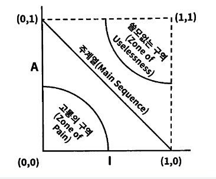

# CH02 아키텍처 개요

## 네 개의 영역

앞에서 아키텍처에 대해서 간단히 살펴보았는데 여기서 자세히 한 번 더 짚고 넘어가고 있다.

### 표현영역

사용자(프론트에서의 사용자 요청 및 외부 백엔드 서버의 호출)의 요청에 대해서 응용영역이 이를 필요한 형식으로 받아 처리할 수 있도록 데이터를 변환해준다. 그리고 응용 영역에서 전달된 데이터를 사용자에게 전달하는 과정에서도 필요한 응답형식으로 바꿔서 전달하는 역할을 한다.

### 응용영역

사용자가 호출한 기능을 수행하는 영역이다. 하지만 도메인에 대한 로직이 구현되는 영역은 아니며, 도메인 영역의 객체들을 가져와 사용해서 필요한 기능을 수행한다. 기능을 직접 수행하는 것이 아니라 도메인 모델에 로직 수행을 위임하는 것이다.

### 도메인 영역

엔티티, 값 객체로 이뤄진 도메인 객체들을 말한다. 각 해당 도메인의 핵심 로직이 구현된 레이어다. 여기서 구현된 로직들이 응용 영역에서 호출되어 사용된다.

### 인프라스트럭처 영역

구현 기술에 관한 영역이다. 어플리케이션 내 어떤 영역에서든지 특정 기술을 쓸 때 인프라스트럭처 레이어를 통해서 사용하게 된다. 당연한 이야기이지만 비즈니스 로직은 일체 들어가지 않으며 오로지 기술의 구현을 책임지고 이를 라이브러리처럼 다른 레이어에 제공하는 것이 핵심인 레이어이다.

## 계층 구조 아키텍처

<figure><figcaption></figcaption></figure>

상위계층에서 바로 밑 하위 계층으로의 의존만 하는 것이 일반적인 구조이지만 편의를 위해 아래와 같이 더 아래 계층으로의 의존도 발생한다.

<figure><figcaption></figcaption></figure>

그런데 이 때 문제가 되는 것이 응용 계층에서 인프라스트럭처 계층을 의존하는 과정에서 '특정한 기술에 종속'되는 현상이 발생한다는 것이다. 이렇게 되면 두 가지 문제가 발생한다.

1. 기술을 변경해야할 상황이 생겼을때 이미 응용 계층에서 많은 코드가 특정 기술에 종속되어 있어서 기술 변경이 어려워진다.
2. 해당 응용 서비스 코드를 테스트하려면 의존하고 있는 그 특정 기술까지 함께 동작해야해서 의도치 않게 검증 단위가 커진다.

극단적인 예시로 만약 JPA 에 종속되어 있다는 가정을 해본다면, 응용 계층에서 JPA 의 dirty checking 이나 write behind 와 같은 특정한 기술을 감안하고 코드를 작성해 놨는데 이를 document DB 등으로 바꾸게 되면 전반적인 로직 자체를 다시 작성해야 하는 상황이 발생한다.

이러한 상황을 해결할 수 있는 개념이 [DIP(의존 역전 원칙)](https://ko.wikipedia.org/wiki/%EC%9D%98%EC%A1%B4%EA%B4%80%EA%B3%84\_%EC%97%AD%EC%A0%84\_%EC%9B%90%EC%B9%99) 이다.

## DIP(Dependency Inversion Principle)

DIP 를 이해하기 위해서는 먼저 고수준 모듈과 저수준 모듈이라는 두 개념에 대해서 이해가 필요하다.

### 고수준 모듈과 저수준 모듈

<figure><figcaption></figcaption></figure>

책에서 예로 들고 있는 고수준 모듈과 저수준 모듈이다. 고수준 모듈은 의미 있는 단일 기능을 제공하는 모듈이며, 저수준 모듈은 고수준 모듈의 기능을 구현하기 위한 구체화된 하위 기능을 의미한다. 위키백과에는 고수준 모듈은 '정책 결정' 이고 하위 모듈은 '세부 사항' 이라고 정리되어 있다.

### DIP 구현

고수준 모듈이 저수준 모듈에 의존하는 것에서 문제가 생긴 것이기 때문에 이를 역전 시키면 된다. 즉, 고수준 모듈에서 저수준 모듈을 의존하던 의존의 방향성을 저수준 모듈이 고수준 모듈을 의존하도록 역전 시키는 것이다.

아래는 위키 백과에 있는 그림이다. 위에 있는 것이 전통적인 형태의 의존 관계로 고수준이 저수준에 의존하고 있는 모습이고 아래의 모습이 추상화(인터페이스)를 이용해서 저수준(Mechanism Layer)이 고수준에 의존하도록 의존 방향을 역전 시킨 모습이다.

<figure><figcaption></figcaption></figure>

<figure><figcaption></figcaption></figure>

### DIP 주의사항

핵심은 추상화를 통해서 저수준이 고수준에 의존하도록 하는 것이다. 따라서 인터페이스 혹 은 추상클래스는 고수준 모듈에 속해야 한다.

<figure><figcaption>
d
</figcaption></figure>

위와 같은 형태가 제대로 구현된 DIP 이다.

<figure><figcaption></figcaption></figure>

