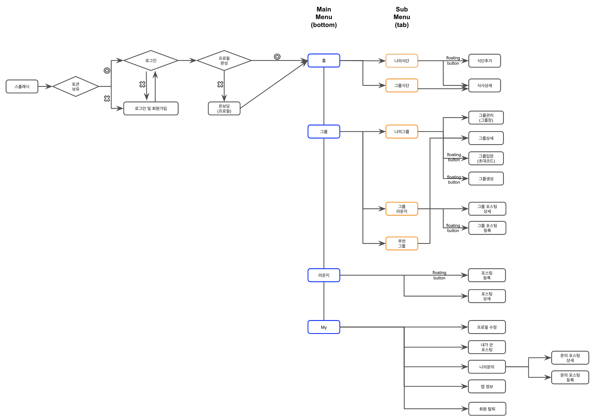

# 2023. 07

### 07/02

* [x] GRMC figma 작성(17:30 \~ 20:00)

### 07/03

* [x] GRMC figma 작성 - 식단추가 (09:30 \~ 10:30)
* [x] GRMC figma 작성 - 식사 상세(\~ 12:30)
* [x] GRMC figma 작성 - 그룹 - 나의그룹(14:00 \~ 16:00)
* [x] GRMC figma 작성 - 그룹 - 그룹라운지(16:00 \~ 17:00)
* [x] GRMC figma 작성 - 마이(17:00 \~ 19:00)
* [x] GRMC figma 작성 - 그룹 - 추천 그룹(19:00 \~ 19:30)

### 07/04

* [x] GRMC 회고 기록(09:50 \~ 11:25)
* [x] FSQD 일정 계획<mark style="color:red;">**(구체적이고 실천 가능하게 수립. 가장 중요. 무리하지도 않게 느슨하지도 않게)**</mark>(11:30 \~ 12:40)
  * [x] 이미 작업 진행된 것도 카드 만들어서 완료 처리하기(기획 및 디자인 등)
  * [x] 이미 작업 진행된 것 산출물도 지라 카드에 업로드(\~ 12:00)
  * [x] 향후 진행 필요 작업 에픽 및 카드 생성(\~ 12:40)

<figure><figcaption></figcaption></figure>

<figure><figcaption></figcaption></figure>

<figure><figcaption></figcaption></figure>

<figure><figcaption></figcaption></figure>

* 일주일 7일중 6일을 작업 가능일로 계산했고, sub menu 하나에 2.5일 걸린다고 보고 일정 계획을 했다. 사실 좀 촉박한 것 같긴한데 7월 내 개발 완료 맞추려면 이렇게 일정을 잡아야 한다.
* 서브 task 관계를 묶어서 혹시 모를 일정 재조정을 할 수 있도록 했고, 작업 단위를 크게 혹은 작게 두 관점으로 볼 수 있도록 했다.
* 결론적으로 서비스 개발 에픽은 아래 4개의 스프린트에 의해서 완료된다.\
  \- 07/04 - 07/09\
  \- 07/10 - 07/16\
  \- 07/17 - 07/23\
  \- 07/24 - 07/30

<figure><figcaption></figcaption></figure>

* [x] (+) intellij 관련 오류 수정(13:30 \~ 14:00)
* [x] [앱 fitsquad 신규 레포지토리 생성 및 기존 공통 모듈 구현, 구조 설계](https://fistkim.atlassian.net/jira/software/projects/FSQD/boards/3?selectedIssue=FSQD-58)(\~14:15)
  * [x] 레포지토리 생성 및 프로젝트 생성
* [x] application layer 구현
  * [x] di 구현
  * [x] easy\_localization 구현
  * [x] environment 구현
  * [x] go\_router 구현(라우터 설정 등)

### 07/05

* [x] [스플래시](https://fistkim.atlassian.net/jira/software/projects/FSQD/boards/3?selectedIssue=FSQD-9)~~(10:00 \~~~&#x20;
  * [x] view <-> viewmodel 구현(모든 이벤트 및 상태 구현, 이벤트 및 상태 별 화면 로직 구현)( \~ 15:40)
  * [x] ~~view 구현(\~ 17:30)~~
* [x] response to model 포스팅 간단히 정리&#x20;
* [x] network 관련 구현 및 data layer 패키지 분리 구조 설계
* [x] theme\_manager 구현 (모든 presentation resource 를 theme 에서 가져오도록 하여 추후 theme 변경 가능하도록 처리)

### 07/06

* [x] GoF 디자인 패턴 (싱글톤) (10:00 \~ 12:00)
* [x] [스플래시](https://fistkim.atlassian.net/jira/software/projects/FSQD/boards/3?selectedIssue=FSQD-9)(13:30 \~ 16:50)
  * [x] view 구현
  * [x] viewmodel 이벤트 처리 로직 변경
  * [x] 로딩 스피너 관련 bloc 구조 구현, 디자인 리소스 확정
* [x] 만들면서 배우는 Spring 3기 정리(\~ CH02)(20:30 \~ 11:30)

### 07/07

<figure><figcaption></figcaption></figure>

* [x] GoF 디자인 패턴 (팩토리 메소드)(10:00 \~ 11:20)
* [x] [서버 프로젝트 세팅](https://fistkim.atlassian.net/jira/software/projects/FSQD/boards/3?selectedIssue=FSQD-59)(11:30 \~ 12:50)(14:10 \~ 16:00)
* [x] [스플래시 - 로그인 API (mock)](https://fistkim.atlassian.net/jira/software/projects/FSQD/boards/3?selectedIssue=FSQD-60)(16:00 \~ 17:00)
* [x] 인프라공방 예전 포스팅 관련 필요 부분 복습 및 정리(17:20 \~ 18:30)

### 07/10

* [x] 일정 재점검 및 기타 이슈 정리(09:00 \~ 10:30)
* [x] [서버 도메인 구현 - 사용자](https://fistkim.atlassian.net/jira/software/projects/FSQD/boards/3?selectedIssue=FSQD-61)(10:30 \~  13:30) (14:30 \~ 17:40)
  * [x] 로그인 API (accessToken 으로 토큰 재발급 및 refreshToken rotation)
  * [x] 계속하기 API(=소셜 로그인)
  * [x] 토큰 재발급(refresh token 활용한 토큰 재발급 및  refreshToken rotation)
* [x] [~~로그인 및 회원가입~~](https://fistkim.atlassian.net/jira/software/projects/FSQD/boards/3?selectedIssue=FSQD-10)~~(17:50 \~ 19:00)~~
* [x] 라우터 흐름도 figma 보고 업데이트 및 7월 작업일지에 재 업로드(이건 집 컴퓨터로 하는게 더 효율적일 듯)(22:00 \~ 23:00)

### 07/11

* [x] [로그인 및 회원가입](https://fistkim.atlassian.net/jira/software/projects/FSQD/boards/3?selectedIssue=FSQD-10)(10:00 \~ 14:10)(15:00 \~ 19:00)
  * [x] bloc 패턴 구현(event 및 state 정의)
  * [x] 화면 리소스 서치 및 화면 구현ㅇ
  * [x] bloc 내부 로직 구현 및 로그인 서드파티 연결
    * [x] 구글  로그인
    * [x] 페이스북 로그인

### 07/12

* [x] 디자인 패턴(추상 팩토리)(09:00 \~ 11:50)
* [x] [로그인 및 회원가입](https://fistkim.atlassian.net/jira/software/projects/FSQD/boards/3?selectedIssue=FSQD-10)(12:00 \~ 12:50)(13:50 \~ 15:10)
  * [x] bloc 내부 로직 구현 및 로그인 서드파티 연결
    * [x] 카카오 로그인
    * [x] 애플 로그인
  * [x] dialog 공통 위젯 구현 및 예외시 발생 시켜야 하는 부분 전부 적용
  * [x] exception 처리 관련 로직 변경
* [x] [~~온보딩~~](https://fistkim.atlassian.net/jira/software/projects/FSQD/boards/3?selectedIssue=FSQD-11)~~(15:20 \~ 16:10)~~
  * [x] ~~willPop 관련 스터디 후 적용~~
  * [x] view, viewmodel(bloc, state, event) 정의
  * [x] ~~view 구현 및 view <-> viewmodel 로직 구현~~
  * [x] ~~viewmode <-> server 구현~~
    * [x] ~~온보딩 API(서버 백로그~~

### 07/13

* [x] &#x20;[~~온보딩~~](https://fistkim.atlassian.net/jira/software/projects/FSQD/boards/3?selectedIssue=FSQD-11)~~(10:00 \~ 12:15)(1:20 \~ 20:40)~~
  * [x] 로그인 관련 버그 픽스(서버, 앱 모두)(10:00 \~ 11:30)
  * [x] willPop 관련 스터디 후 적용
  * [x] view 구현 및 view <-> viewmodel 로직 구현(\~ 20:40)
  * [x] ~~viewmode <-> server 구현~~
    * [x] ~~온보딩 API(서버 백로그)~~

### 07/14

* [x] [~~온보딩~~](https://fistkim.atlassian.net/jira/software/projects/FSQD/boards/3?selectedIssue=FSQD-11)~~(10:00 \~~~
  * [x] 완료화면 구현 및 이동처리(10:00 \~ 11:00)
  * [x] ~~viewmode <-> server 구현(11:00 \~~~&#x20;
    * [x] ~~data layer 로직 구현 및 viewmodel, view 로직 처리(앱쪽에 필요한 모든 구현 완료)~~\
      ~~- fix: 프로필 완료시 PageView 첫 페이지로 돌아가는 현상~~\
      ~~- fix: 의도치 않게 버튼 두번 누르게 되는 경우~~
    * [x] ~~인증필터 구현(서버 백로그)~~
    * [x] ~~온보딩 API(서버 백로그)~~

cf. 7월 14일은 11:00 부터 PageView 관련 버그처리 내내 진행 (11:00 \~ 19:00) 해결하지 못했음.

* 현상: onboarding\_screen 내 pageView 가 최종 page 에서 bloc 이벤트 추가시 핸들러가 이를 받아 진행중에 갑자기 pageView 가 첫번째 페이지로 돌아가버리는 현상
* 원인: 디버그로 확인해보니 첫번째 Page의 BuildContext 가 dirty 로 변하면서 재 렌더링이 발생한다. bloc 내에서 즉시 익셉션을 반환하는 식으로 코드 블록을 나눠가며 추적해보니 비동기 로직을 만나면 일정 확률로 그러한 현상이 발생.

### 07/15

* [x] pageView 버그 픽스(10:30 \~ 14:30)
* [x] 프로필 등록 서버 핸들러 형태 구현(14:30 \~ 15:30)

cf 1. 결국 PageView 를 그냥 거둬내고 PageView 형식으로 위젯을 갈아끼우는 방식(PageView 와 거의 유사한 방식이지만 손수 구현한 방식의) 으로 해결. Bloc 내에서 await 만나면 PageView 의 렌더링에 flutter 프레임워크 자체가 영향을 주고 있어서 그냥 PageView 를 쓰지 않으면 영향을 받지 않는 것으로 판단하여 이렇게 진행하였고 해결됨.

cf 2. 사실상 우회해서 구현하니 5분도 안걸림. 처음부터 우회하는 전략은 좋지 못하지만 앞으로는 일정 시간을 분석하고 해결하는데 사용하고 그걸 넘기면 바로 우회하도록 하자. 그리고 백퍼센트 파악하지 못한 그런 부분은 백로그로 남겨두고 나중에 다시 진행하는 방식으로 해야 일정에 무리가 없다.

### 07/17

* [x] 온보딩 관련 서버 작업(09:30 \~ 19:30)
  * [x] 온보딩 API domain 모듈 작업 (서버 백로그)(09:30 \~ 13:30)
  * [x] 서버 로깅필터쪽 HTTP 프로토콜 파싱부분 null 오류 처리 및 현재 폼데이터 처리시 오류 발생하고 있음. 로깅필터의 본래 목적에 맞게 필요한 정보만 읽게 하는거랑 오류 나도 무시하고 잘 진행 되도록 전반적으로 로깅 필터 작동 원리랑 구현한거 다시 점검하기(15:00 \~ 15:40)
  * [x] 인증필터 구현(서버 백로그)(15:40 \~ 16:30)
  * [x] 온보딩 API 핸들러 구현 및 앱에서 POST 요청 실제로 저장 되는지 전체 플로우 점검 및 이미지 저장 Async 체크(16:30 \~ 19:30)
    * [x] async 처리시 파일 못찾는 문제해결 (tmp 확장자로 들어오는 문제?)

### 07/18

* [ ] 홈

\

### 이월 백로그

* [ ] Clean Architecture 각 레이어 완성 후 패키지 스크린 샷 첨부 및 서브 페이지 관련 작업들 전부 다 해주기(다른 프로젝트에도 공통적으로 적용될 사항들은 빠짐 없이 모두 서브페이지로 정리한다)
* [ ] go\_router 구현 포스팅 정리(간략하게, 유투브 참고했던것 링크 같이)

<figure><figcaption></figcaption></figure>

### FSQD 앱 백로그

* [x] [스플래시](https://fistkim.atlassian.net/browse/FSQD-9)
* [x] [로그인 및 회원가입](https://fistkim.atlassian.net/jira/software/projects/FSQD/boards/3?selectedIssue=FSQD-10)
* [ ] [온보딩](https://fistkim.atlassian.net/jira/software/projects/FSQD/boards/3?selectedIssue=FSQD-11)
* [ ] 홈
  * [ ] 나의 식단
    * [ ] 식단 목록 조회
    * [ ] 식단 상세 조회
    * [ ] 식단 기록 추가
  * [ ] 그룹식단
    * [ ] 식단 목록 조회
    * [ ] 피드백(이모티콘) 등록
    * [ ] 피드백(이모티콘) 수정
    * [ ] 피드백(댓글, 대댓글) 등록
    * [ ] 피드백(댓글, 대댓글) 수정 및 삭제
* [ ] 그룹
  * [ ] 나의 그룹
    * [ ] 그룹 목록 조회
    * [ ] 그룹 생성
    * [ ] 그룹 코드 입력 및 가입
    * [ ] 그룹 상세 조회
    * [ ] 그룹관리(그룹 수정)
    * [ ] 그룹관리(그룹원 추방 및 가입승인)
  * [ ] 그룹 라운지
    * [ ] 포스팅 목록 조회
    * [ ] 포스팅 상세 조회
    * [ ] 포스팅 등록
    * [ ] 포스팅 수정
    * [ ] 포스팅 댓글, 대댓글 등록
    * [ ] 포스팅 댓글 삭제 및 수정
    * [ ] 포스팅 좋아요 등록 및 수정
  * [ ] 추천 그룹
* [ ] 라운지
  * [ ] 포스팅 등록
  * [ ] 포스팅 상세 조회
  * [ ] 포스팅 댓글, 대댓글 등록
  * [ ] 포스팅 댓글, 대댓글 수정 및 삭제
  * [ ] 포스팅 좋아요
  * [ ] 포스팅 목록 조회
* [ ] 마이
  * [ ] 내가 쓴 포스팅
  * [ ] 나의 문의
    * [ ] 나의 문의 목록 ㅗㅈ회
    * [ ] 나의 문의 등록
    * [ ] 나의 문의 수정 및 삭제
  * [ ] 앱 정보
  * [ ] 회원 탈퇴
  * [ ] 로그아웃
  * [ ] 프로필 수정

### FSQD 서버 백로그

* [x] [서버 프로젝트 세팅](https://fistkim.atlassian.net/jira/software/projects/FSQD/boards/3?selectedIssue=FSQD-59)
* [x] [스플래시 - 로그인 API (mock)](https://fistkim.atlassian.net/jira/software/projects/FSQD/boards/3?selectedIssue=FSQD-60)
* [ ] [서버 도메인 구현 - 사용자](https://fistkim.atlassian.net/jira/software/projects/FSQD/boards/3?selectedIssue=FSQD-61)
  * [x] 로그인 API (accessToken 으로 토큰 재발급 및 refreshToken rotation)
  * [x] 계속하기 API(=소셜 로그인)
  * [x] 토큰 재발급 API(refresh token 활용한 토큰 재발급 및  refreshToken rotation)
  * [ ] 회원 탈퇴 API(My)
  * [ ] 프로필 정보 변경 API(My)
  * [ ] 온보딩 API
  * [ ] 인증필터 구현
* [ ] [서버 도메인 구현 - 식단](https://fistkim.atlassian.net/jira/software/projects/FSQD/boards/3?selectedIssue=FSQD-62)
* [ ] [서버 도메인 구현 - 그룹](https://fistkim.atlassian.net/jira/software/projects/FSQD/boards/3?selectedIssue=FSQD-63)
* [ ] [서버 도메인 구현 - 그룹원](https://fistkim.atlassian.net/jira/software/projects/FSQD/boards/3?selectedIssue=FSQD-64)

### FSQD 기획 및 디자인 관련 백로그

* 도메인 모델링 처음부터 다시.
* 새로운 피그마 만들어서 앱 플로우에 따라 기획 및 디자인 동시 진행.
* 완전히 세세한 수준까지 모든 의사결정 완료(미루는 항목은 없어야한다). '개발 할 때 기획 및 디자인에 대해서 추가적인 고민이 0.1도 없어야 한다' 가 기준이다.

<!---->

* [x] 스플래시
* [x] 로그인 및 회원가입
* [x] 온보딩(2h)
* [x] **홈(bottom)**(7h)
  * [x] 나의식단(sub)
    * [x] 나의 식단 목록(1.5h)
    * [x] 나의 식단 추가(1h)
  * [x] 그룹식단(sub)
    * [x] 그룹식단목록(2.5h)
    * [x] 식사 상세(2h)
* [x] **그룹(bottom)**(3.5h)
  * [x] 나의그룹(sub)(2h)
    * [x] 그룹관리(그룹장)
    * [x] 그룹상세
    * [x] 그룹입장(초대코드)
    * [x] 그룹생성
  * [x] 그룹라운지(sub)(1h)
    * [x] 그룹 포스팅 상세(10min)
    * [x] 그룹 포스팅 등록&수정(20min)
    * [x] 그룹 포스팅 목록(30min)
  * [x] 추천 목록(sub)(30min)
* [x] **라운지(bottom)**(30min)
  * [x] 라운지 목록
  * [x] 라운지 포스팅 등록
  * [x] 라운지 포스팅 상세
* [x] **My(bottom)**(2h)
  * [x] My 목록
  * [x] 프로필 수정
  * [x] 내가 쓴 포스팅
  * [x] 나의 문의
    * [x] 문의하기 등록
    * [x] 나의 문의 목록
  * [x] ~~나의 활동 기록(phase 2)~~
  * [x] 앱정보
  * [x] 회원탈퇴
  * [x] 로그아웃

### GRMC 프로젝트 진행 일정 요약

* 04/28 \~ 05/04 : 서비스 기획 및 디자인 확정
* 05/05 \~ 05/12 : 멀티모듈 프로젝트 설계 및 공통모듈 구현
* 05/13 \~ 06/02 : 핵심 도메인 모듈 구현
* 06/03 \~ 06/11 : 이전 플러터 학습 대략적인 복습 및 GRMC 라우터 흐름 재정의, 공통코드 구현
* 06/12 \~ 06/25 : 화면 단위로 차례로 앱 구현

### GRMC 프로젝트 회고

#### 잘한 점

1. 결론적으로 방향을 크게 틀게 되었지만 정석적인 흐름대로 기획, 피그마 제작, 서버구현, 앱구현의 방식으로 밀고 나갔다. 매일 '이게 맞나, 잘하고 있나' 생각이 들었지만 마음을 잡고 계속 밀고 나간 것.
2. 앱 구조를 잘 잡은 것 같다.(물론 '잘 잡았다' 는 것에 대한 근거는 없고, 오로지 개인 생각이다.) 아직 프로젝트를 완성한 것도 아니지만 아무래도 서버는 실무에서 많이 했으니 걱정이 없었는데, 앱은 경험이 부족하다보니 여러 오픈소스 및 클린 아키텍처 강의를 참고해서 내가 생각하기에 최적의 형태로 구현하고자 노력했다.\
   \
   결과적으로 뼈대는 클린 아키텍처 강의 그대로를 따르되 여러 오픈 소스를 참고해서 Bloc 을 주입하는 부분이나 DI 관련해서 커스텀을 했는데 화면을 하나하나 붙여 나갈때마다 복잡도가 막 늘어난다던가 하지 않고 확장적인 것 같다는 느낌을 받았다. 다만 네트워크 처리 부분이 다소 아쉬운 부분이 있는데, 보완하면 된다.
3. 규칙적으로 진행하고 생활 한 것. 평일은 무조건 공유오피스 출근 원칙을 지켰고, 출근해서는 최선의 밀도로 집중했던 것 같다.
4. 답답하다고 딴 짓 하지 않고, 집중이 흐트러질때 학습을 진행 하는 방식으로 해서 시간 낭비를 하지 않았다.

#### 못한 점

1. 운동을 너무 챙겨 갔다. 거의 매일 간 것 같은데 이걸 못한 점에 넣으려니 좀 그렇지만 상황상 일주일에 2\~3일은 운동을 포기하고 개발을 더 했어야 했는데 좀 느슨했던 것 같다.
2. 기획이 세밀하지 못했다. 내가 크게 오판한 부분인데, 메인 flow 에 대해서 확실하되 서브메뉴나 중요하지 않은 기능에 대해서는 구현 하면서 인터페이스로 빼놓고 추후에 구현을 하는 것이 오히려 더 좋은 기획이 나올거라 생각했다.\
   \
   이유는 기획 단계에서 쥐어짜서 기획을 넣기 보다 메인 기능은 세밀하게 확정을 해뒀으니 그걸 서버 및 앱에서 구현을 하다 보면 더 좋은, 최적의 기획이 나올 거라 생각했기 때문이다.\
   \
   결과적으로 잘못된 판단이었다. 왜냐하면 내 생각에 중요하지 않은 디테일함이 중요한 메인 flow 에 영향을 많이 주는 경우도 있는 것 같고, 100% 정해지지 않고 개발을 하다 보니 자꾸 변경을 고려하게 되고 일정을 제대로 계산하는게 쉽지 않았다. 매우 잘못된 판단이었다.\
   \
   물론 상황이 어쩔 수 없다면 이 방법이 맞긴 했는데, 모든 작업을 내가 하는 상황이고 어떤 외부 요인도 없기 때문에 세밀하게 다 정하고 가는게 맞았다.
3. 2번과 비슷한 맥락인데 디자인 리소스를 100% 확정하고 갔어야 했다. 와이어 프레임만 정하고 세부 요소들은 참고할 서비스들의 스크린 샷을 옆에 쭉 나열해두는 식으로 피그마 파일을 만들었는데 결과적으로 구현할 때 어차피 다시 마주칠 고민들이었다.\
   \
   그렇게 처리했던 이유는 구현을 하는 단계에서 내가 잘 몰랐던 라이브러리나 디자인 리소스들이 모인 사이트 등에서 더 좋은 리소스를 찾게 될 수도 있으니 더 좋은 결과물을 위해서 오히려 다 정하지 않고 여지를 조금 열어두는게 좋다고 생각했다. 왜냐면 난 디자이너가 아니니까 그 단계에서 최선의 결과물을 만들 자신이 없었다.\
   \
   이것도 2번과 비슷한 맥락에서 아주 잘못된 판단이었다. 특정 화면을 두고 A, B, C, D 와 같은 여러 옵션들을 뽑아두고 해당 화면을 구현하는 단계에서 옵션들 중 하나를 정하다 보니 화면간의 통일성도 깨지고 정하는 과정에서도 자꾸 선택이 번복되어서 일정이 더 소모되었다.\
   \
   결과적으로 이 방식이 나에겐 적절하지 못했는데, 당시에는 지라 카드에 아래와 같이 메모까지 남겨두었다. 기록을 위해 여기도 남긴다.\
   \
   'figma 에서의 완성된 디자인은 결국 디자이너와 개발자의 커뮤니케이션 때문인 목적이 가장 큰데 나는 내가 개발자이면서 디자이너가 되어야하기 때문에 그러한 커뮤니케이션이 아무 필요가 없다. 따라서 내가 와이어프레임을 기준으로 후보 디자인 리소스들을 서치 단계에서 나열하고 최종본을 선정한뒤, 개발을 완료하고 개발된 화면을 스샷을 찍어서 figma 에 첨부하는 흐름이 더 효율적이고 적절하다.'\
   \
   결과적으로 이건 잘못된 판단이었다.
4. 서버랑 앱을 둘 다 내가 작업을 하는데, 심지어 서버를 거의 구현을 다 한 상태인데도 당장의 편함 때문에 앱에서 Mock 데이터로 처리를 하면서 구현을 진행했다. 명백하게 잘못된 행동이었다. 어차피 나중에 연결하면서 공수가 들어갈 것이고, 예상하지 못한 버그를 나중에 발견하게 되어 수정 비용이 더 들수도 있는 상황이었다.

#### 다음에 반영할 것(개선 사항)

1. GRMC 에서는 기획을 90% 정도 확정했고 디자인을 50% 정도 확정한 뒤 이를 산출물로 만들고 서버 구현 후 앱을 구현했다.\
   FSQD 에서는 기획 100%, 디자인 100% 모두 확정 짓고 서버와 앱을 기능 단위로 동시에 진행하면서 처리하도록 한다.(이미 기획 100%, 디자인 100% 확정 완료 하였고 산출물도 만든 상태)
2. 앱 관련하여 Data Layer 에서 Domain 별로 패키지 및 client 분리가 제대로 이뤄지지 않았다. GRMC 그대로 갔으면 당장 구현은 되었겠지만 구조적으로 좋지 못한 설계가 되었을 것이다. FSQD 에서는 이 부분을 개선하도록 한다.(Domain 에 따라서 Data Layer 에서 세부적으로 나누고 이를 Domain 각각이 의존하도록 개선한다.)
3. 일정을 조금 더 타이트하게 설정한다. 동시에 달성하기 어렵겠지만 일정을 타이트하게 잡되 계획 자체를 구체적이고 실행 가능하게 산출한다. 일주일 중 2\~3일 정도는 운동을 포기하고 개발을 더 진행하자.
