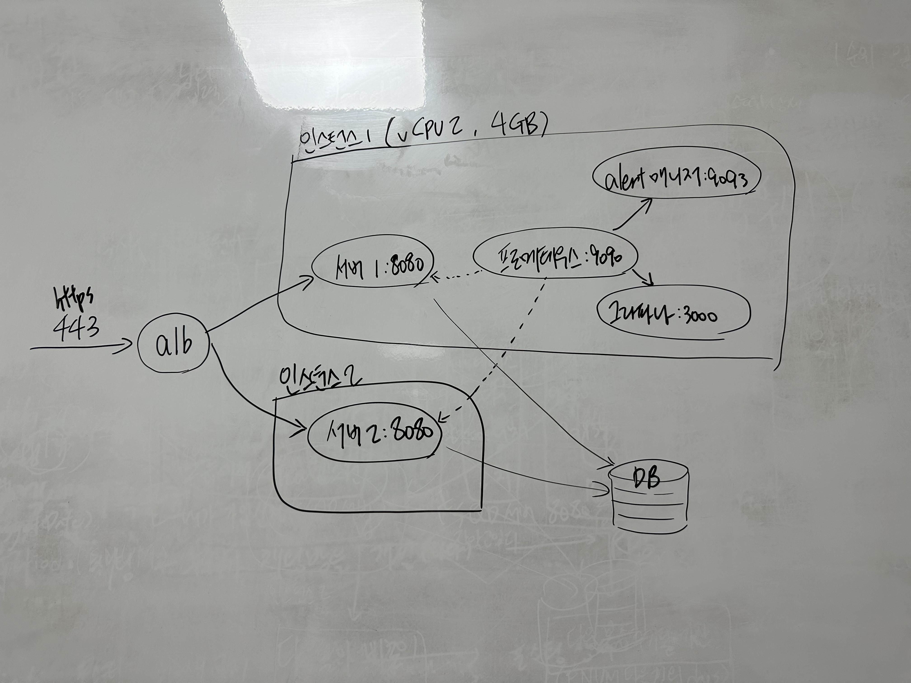

# 2023. 08

## 1주차(07/31 \~ 08/06)

**목표: 서버 백로그 인프라 제외하고 구현 모두 완료**

<figure><figcaption></figcaption></figure>


## 2주차(08/07 \~ 08/11)

**목표: 앱 개발 완료 및 미뤄둔 백로그(소셜쪽 디버깅 및 QA) 모두 완료**

<figure><figcaption></figcaption></figure>

<figure><figcaption></figcaption></figure>


## 3주차, 4주차(08/12 \~ 8/26)

모든 개발이 완료되었고, 베타 테스터 2명 동원하여 개선 사항 및 버그 픽스 완료. 개발 관련 상용 배포 전 모든 작업 완료.

QA 때 처음에 부수적이라 생각해서 후순위로 미뤘던 기능이 없어서 아쉽다는 피드백을 받았고, 버그 및 후순위로 미뤄둔 보강작업 모두 진행 완료. 앱푸시 백그라운드, 포그라운드 연동 완료. 운영서버 세팅 후 운영에서 한번 쭉 테스트 후 최종 심사 요청 예정.

<figure><figcaption></figcaption></figure>

<figure><figcaption></figcaption></figure>


## 5주차(08/28 \~ 08/31)

<figure><figcaption></figcaption></figure>

<figure><figcaption></figcaption></figure>

<figure><figcaption></figcaption></figure>

두 마켓 모두 심사 요청 완료


<figure><figcaption></figcaption></figure>

원래 빈스토크로 서버를 띄우고 프리티어 인스턴스 따로 띄워서 거기서 모니터링 하려고 했는데, 일단 트래픽이 얼마나 나올지 종잡을 수 없어서(=크게 기대가 막 되진 않아서) 일단 저렇게 구성했다.

인스턴스1, 2 에는 각각 서버를 서비스로 등록해둔 상태이며 인스턴스2의 경우 돈을 아끼려면 인스턴스 자체를 내려놨다가 인스턴스1이 트래픽을 감당하지 못할 것 같으면 인스턴스를 바로 띄우면 되도록 해두었다.

EC2도 오토스케일링을 지원하지만 이걸 쓰면 서비스 디스커버리를 설정을 해야할 것 같아서 자동화 하진 않았다. 프로메테우스에서 cpu 80퍼센트 이상 혹은 힙 메모리 80프로 이상 사용시 alertManager 에 의해서 slack 알림이 오도록 처리해두었다.

```yaml
groups:
  - name: HighCpuUsage
    rules:
      - alert: HighCpuUsage
        expr: (100 * (1 - avg by(instance) (irate(node_cpu_seconds_total{mode="idle"}[5m])))) > 80
        for: 1m
        labels:
          severity: critical
        annotations:
          summary: "High CPU usage detected"
          description: "CPU usage is above 80% for more than 1 minute."

```

```yaml
groups:
  - name: HeapMemoryHigh
    rules:
      - alert: HeapMemoryHigh
        expr: (jvm_memory_used_bytes{area="heap"} / jvm_memory_max_bytes{area="heap"}) > 0.8
        for: 1m
        labels:
          severity: critical
        annotations:
          summary: "Heap memory is more than 80% for 1 minute"

```


프로메테우스의 alert 는 처음 써봐서 로컬에서 테스트 해봤는데 아래와 같이 잘 오는걸 확인할 수 있었다. 회사에서는 그라파나의 알람 시스템을 이용했었는데, 메일로 오도록 설정해두었었는데 그라파나 자체의 알람 시스템도 다음에 제대로 뜯어 봐야겠다.

<figure><figcaption></figcaption></figure>

