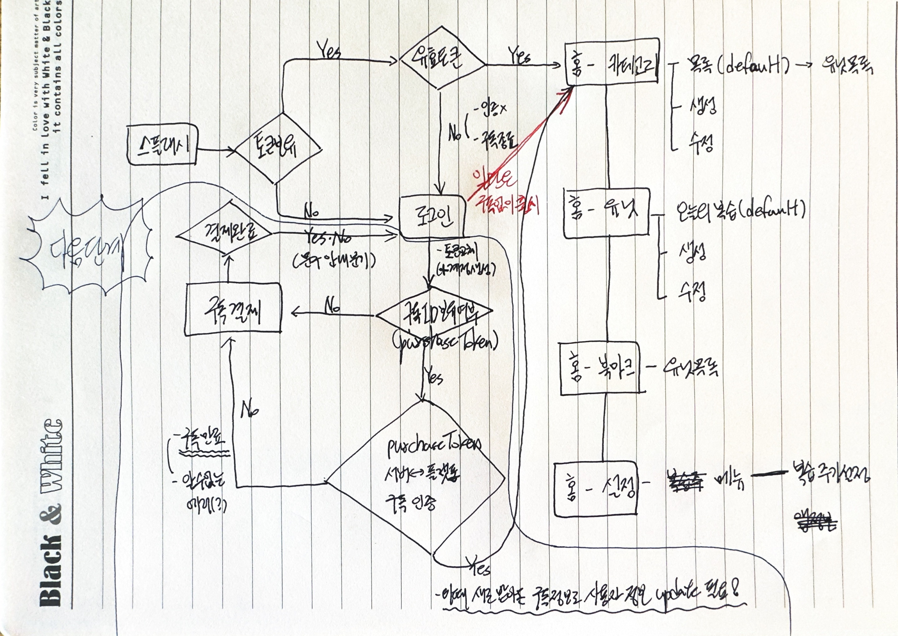

# 2023. 09

### 09/02

* [x] 알고리즘 복습(2h)

### 09/03

* [x] 알고리즘 복습(1h)
* [x] 알고리즘 학습(투포인터, 슬라이딩 윈도우)(2h)

<figure><figcaption></figcaption></figure>

### 09/04

* [x] 학습내용 복습(2h)
* [x] 알고리즘 HashMap, TreeSet (해쉬, 정렬지원 Set)(3h)

<figure><figcaption></figcaption></figure>

### 09/06

* [x] 알고리즘 효율성 복습
* [x] Flutter 아키텍처 레이어 별 정리 및 구현(application layer 전체)
* [x] 알고리즘 HashMap, TreeSet 복습
* [x] 디자인패턴 복습 지라 카드 생성
* [x] F-Lab 스프링 입문을 위한 자바 객체지향의 원리와 이해 지라 카드 생성

<figure><figcaption></figcaption></figure>

### 09/07

* [x] 알고리즘 CH02 복습
* [x] F-Lab 도서(스프링 \~ 이해) CH 01
* [x] 알고리즘 데일리 3개
* [x] MERY 프로젝트 일부 기획 완료
* [x] F-Lab 도서(스프링 \~ 이해) CH 02(일부)

### 09/08

* [x] 플러터 공통 코드 프로젝트 완료(data layer, presentation layer)
* [x] F-Lab 도서(스프링 \~ 이해) CH 02
* [x] F-Lab 도서(스프링 \~ 이해) CH 03
* [x] 알고리즘 Stack 복습
* [x] 알고리즘 데일리 3개

### 09/11

* [x] 스프링 \~ 이해 CH02, 03 메모리 적재 관련 정리
* [x] 스프링 \~ 이해 CH04
* [x] 링크드인 및 노션 수정
* [x] SQNA 신규 jira 프로젝트 생성 및 작업 카드 만들기

<figure><figcaption></figcaption></figure>

### 09/12

* [x] 스프링 \~ 이해 CH05
* [x] SQNA jira 카드 쳐내기(최소 4시간 이상 투자)(+진행하면서 공통 코드에 필요한 것 계속 추가)
* [x] Material Design 3 적용 관련 공식 문서 전체적으로 파악하기(이번 프로젝트에 적용 할지를 고민하는 판단 기준을 찾는 과정으로 인지)

<figure><figcaption></figcaption></figure>

<figure><figcaption></figcaption></figure>

### 09/13

* [x] SQNA 구현 (08:30 \~ 17:00)
* [x] 스프링 \~ 이해 CH06

<figure><figcaption></figcaption></figure>

### 09/14

* [x] 스프링 \~ 이해 CH07
* [x] 스프링 \~ 이해 부록1, 2(람다)
* [x] F-Lab 멘토님이 하라고 하신 것들 리스트업 후 토픽으로 정리
  * [x] 상속과 합성의 구분
  * [x] '상태'에 대한 정의를 다시 곱씹어보기. 변수라고 다 상태라 봐야하나.
  * [x] 오버로딩과 오버라이딩이 결국엔 무엇을 위해? 설계자가 무엇을 의도하고 배려(?)하여 이러한 장치를 만들었을까
  * [x] 링크드인 프로필 수정(팀 이름 기재, 일부 구체화 등)
* [x] FSQD 구글 로그인 관련 운영으로 전환 관련 스터디 및 전환신청
* [x] FSQD 아이콘 변경 및 플레이스토어, 앱스토어 버전업
* [x] SQNA 홈 구현
* [x] SQNA 홈 진입시 공지사항, 앱버전 체크 로직 후 라우터 이동 구현

### 09/15

* [x] SQNA 전체기능 서버 구현(카테고리, 유닛, 사용자)
* [x] SQNA 카테고리 메뉴 구현

### 09/16

* [x] 이펙티브 자바 읽기+ 백기선님 강의
* [x] SQNA 구현(유닛 관련)(4h)

### 09/17

* [ ] SQNA 프로젝트 완료(설정 > 단계별 복습 주기 설정 기능 제외)(10h)
  * [x] 유닛 카드 View 구현
  * [x] 유닛 복습 실패, 성공 스와이프 구현
  * [x] 유닛 색상 플래그 변경 구현(네이버 플레이스 UI 참고하자) or 색상은 이번에 하지 말던가
  * [x] 카테고리 터치시 유닛들 보는 화면 구현
  * [x] 설정 구현
    * [x] 설정 화면 템플릿 구현
    * [x] 앱 소개(앱 첫 기동시 띄웠던 페이지 띄우면 된다)
    * [x] 로그아웃
    * [x] 회원탈퇴(서버도 구현 필요, alert 로 경고 한번 보여주기)

<figure><figcaption></figcaption></figure>

### 09/18

* [x] SQNA 설정 > 단계별 복습 주기 설정 구현 (1h)
* [x] SQNA 안드로이드 스플래시 기본 아이콘 관련 처리(30min)
* [x] SQNA 서버 세팅 및 심사 요청 준비 및 심사 요청(오후 넘어가기 전에 완료)
  * [x] 서버 세팅
    * [x] AWS gateway 로 네이버 클라우드 코인 소진 할 수 있도록 구조를 짜보자
  * [x] 운영 전체 테스트
  * [x] 배포 관련 스크린샷 및 앱 설명 관련 준비, 개인 정보 URL 등 준비
  * [x] 플레이스토어 심사 넣기
  * [x] 앱스토어 심사 넣기
* [ ] FSQD 아이콘 변경 및 재심사 요청(질질 끌지말고 타이머 맞추고 1.5h 마감효과)
  * [ ] 안드로이드, iOS 아이콘 변경
  * [ ] 안드로이드 스플래시 아이콘 없애기
  * [ ] 카카오 로그인에 아이콘 변경
  * [ ] 구글 로그인 아이콘 변경
  * [ ] 애플 심사 거부건 리스트업 하고 처리
    * [ ] 스크린샷 아이폰으로 변경
    * [ ] 아이패드 버그(?) 원인 찾아 해결
    * [ ] 애플 로그인시 이름 가져와서 디폴트 설정
    * [ ] 성별, 생년월일은 다시 문의

### 이월 백로그

* [x] 플러터 템플릿 프로젝트 만들고 진행하면서 Clean Architecture 각 레이어 완성 후 패키지 스크린 샷 첨부 및 서브 페이지 관련 작업들 전부 다 해주기(다른 프로젝트에도 공통적으로 적용될 사항들은 빠짐 없이 모두 서브페이지로 정리한다)
* [x] go\_router 구현 포스팅 정리(간략하게, 유투브 참고했던것 링크 같이)
* [ ] 디자인패턴 복습 APP 에 학습한 것들 복습 후 유닛 생성
