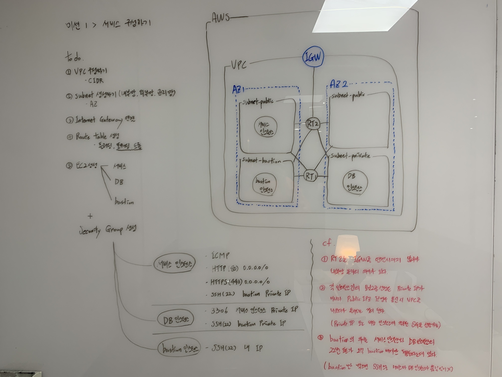

# \[미션 1] 서비스 구성하기 실습

## 들어가며 <a href="#0" id="0"></a>

인프라공방의 첫번째 미션으로 서비스를 구성하는 것을 실습했다. ‘망 분리하기’에서 학습한 그대로 VPC를 만들고 내부에 서브넷으로 망을 구성하였다. 재미있었던 부분은 ‘관리망’ 이라는 망을 따로 두고 이 관리망을 통해서 외부망과 내부망을 관리하는 것이었다.

이와 관련된 개념으로 ‘바스티온’ 이라는 개념이 나왔는데 실제로 [Bastion host](https://en.wikipedia.org/wiki/Bastion\_host) 라고 네트워크 용어로 존재하는 개념이다.

검색되어 나오는 여러 사례들은 Bastion server를 인터넷 게이트웨이처럼 사용하여 한 곳에서 모든 접근을 관리하게 하는 목적으로 사용하고 있었고, 강의 실습에서는 외부망, 내부망의 22번 포트를 통한 접근을 Bastion server 에만 허용해두어 여기에 보안을 집중하는 형태였다.

둘다 신경 써야할 포인트를 일원화 한다는 측면에서 관리의 효율을 도모하고, 보안을 한 곳에 집중하도록 만든다는 공통점이 있었다.

## 1. 미션 요구사항 <a href="#1" id="1"></a>

### **망 구성**

<figure><figcaption></figcaption></figure>


### **웹 애플리케이션 배포**

* 외부망에 웹 애플리케이션 배포


## 2. 미션 실습 <a href="#2" id="2"></a>

### **1) VPC 설정, 서브네팅**

<figure><figcaption></figcaption></figure>

**VPC를 구성할 전체 범위를 CIDR 블록 표기로 설정**


<figure><figcaption></figcaption></figure>

<figure><figcaption></figcaption></figure>

**64개씩 2개 설정하며 동시에 장애를 대비하여 AZ를 다르게 설정**


<figure><figcaption></figcaption></figure>

**내부망과 관리망 각각 32개씩 설정**


.png>)

**CIDR 가 헷갈릴 때 참고할 수 있는 테이블**

\
\


### **2) 인터넷 게이트웨이 생성**


<figure><figcaption></figcaption></figure>

**인터넷 게이트웨이 생성**

\


<figure><figcaption></figcaption></figure>

**생성한 인터넷 게이트웨이를 앞서 생성한 VPC에 연결**


### **3) 라우팅 테이블 생성**

라우팅 테이블을 생성하고 해당 라우팅 테이블과 서브넷을 연결 한 뒤 이후에 서브넷에 생성되는 인스턴스는 라우팅 테이블에 설정한 라우팅들을 학습하게 된다.


<figure><figcaption></figcaption></figure>

**라우팅 테이블을 생성하며 해당 라우팅 테이블과 어떤 VPC와 연결할지 설정**

\
\


<figure><figcaption></figcaption></figure>

**만든 라우팅 테이블과 앞서 만든 인터넷 게이트웨이를 연결해준다. 추가적으로 서브넷도 연결해준다**


> \[주의] 내부망은 인터넷 게이트웨이를 붙이지 않는다. 말 그대로 ‘내부’망이기 위해서는 인터넷과 단절되어야 그 의미가 있기 때문이다.\
> 그래서 내부망에 ssh로 접속하기 위해서는 프라이빗 IP 주소로 접근해야한다.


> 라우팅 테이블에 ‘라우팅’(규칙)을 나열하는 것의 의미에 대해서 질문했다. 확실히 와닿지 않아서. 답변을 통해 정리된 나의 지식을 정리하자면 라우팅 테이블은 아래 와 같다.\
> (1)’목적지(대상)에 따라 어디(대상)로 보낼지’에 대한 규칙들의 집합\
> (2) 해당 라우팅 테이블에 연결된 서브넷 내의 인스턴스들이 통신을 할 때 반드시 거치게 되도록 소프트웨어 적으로 기능(목적지가 VPC 내부일때는 바로 통신)\
> 위 1, 2 로 나의 이해를 정리해보았다. 소프트웨어로 컨트롤 하기에 하드웨어는 아니지만, 하드웨어의 라우터 개념으로 이해하는게 편하다.\
> (+ 라우팅 테이블 내에 local 은 VPC를 의미한다)

\


결국 라우팅 테이블의 최종형태는 아래와 같다.

\


**public**

<figure><figcaption></figcaption></figure>

**internal**

<figure><figcaption></figcaption></figure>


### **4) EC2 생성 및 Security Group 설정**

<figure><figcaption></figcaption></figure>

**EC2 생성시 속하고자 하는 VPC와 서브넷을 설정해줘야 한다**


<figure><figcaption></figcaption></figure>

> bastion의 22번 포트는 오직 내 IP (리얼 우리집 IP)만을 허용해두어서, 나만 접속할 수 있도록 해두었다.\
>

> \[주의] 외부망과 내부망의 보안 그룹에서 관리망을 허용해 줄 때에는 관리망의 public ip를 설정해주는 것이 아니다. 프라이빗 IP주소 로 설정해주거나, 관리망에 적용된 ‘보안그룹’을 설정해 주는 것이 맞다.\
> \
> 왜냐하면 관리망에서 외부망 혹은 내부망으로 접근할 때에 public ip로 접근을 한다는 것은 내부에서 붙는 것이 아니라 VPC 밖으로 나갔다가 들어온다는 이야기가 되기 때문이다. 따라서 VPC 내부에서 붙을 것이기 때문에 프라이빗 IP나 보안그룹으로 설정해주는 것이 옳다.


```
## Bastion Server에서 공개키를 생성합니다.
bastion $ ssh-keygen -t rsa
bastion $ cat ~/.ssh/id_rsa.pub

## 접속하려는 서비스용 서버에 키를 추가합니다.
$ vi ~/.ssh/authorized_keys

## Bastion Server에서 접속을 해봅니다.
bastion $ ssh ubuntu@[서비스용 서버 IP]
```


### **5) 통신 확인하기**

* bastion -> 외부망, 내부망 접속이 잘 되는지 확인
* 내 컴퓨터(bastion 이 아닌 노드) -> 외부망, 내부망 접속이 안되는지 확인(안되는게 의도한 것)

> 다시 강조하지만, 관리망에서 외부망, 내부망에 붙을 때에는 퍼블릭 IP가 아니라 프라이빗 IP로 접속해야한다.


## 총정리(도식화부터 보자) <a href="#undefined" id="undefined"></a>

<figure><figcaption></figcaption></figure>
