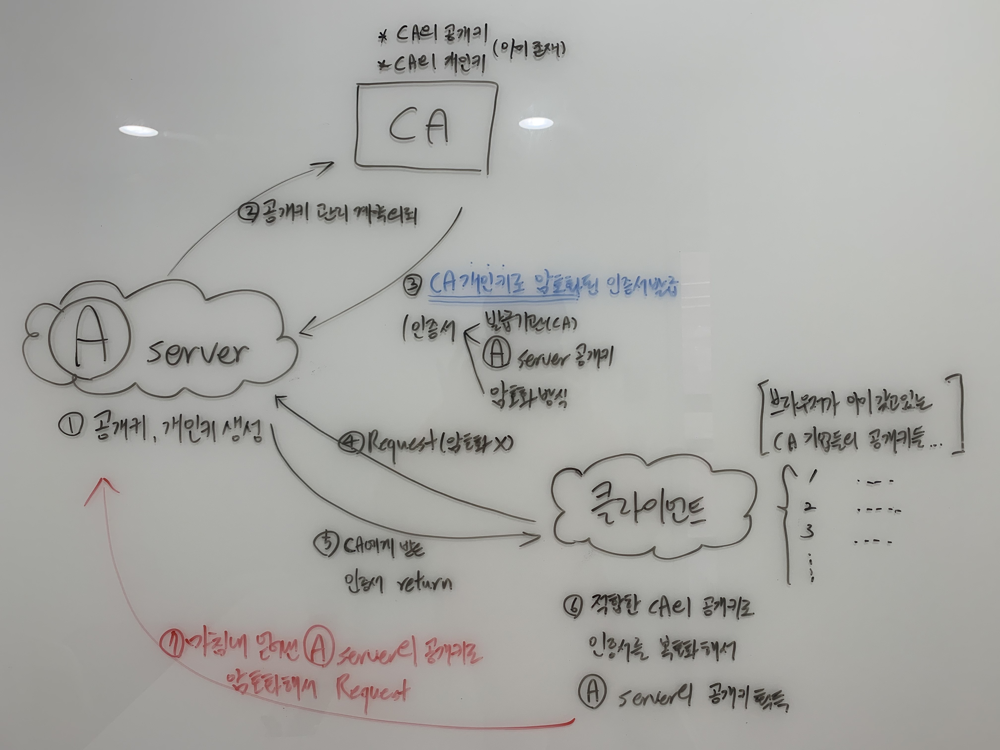
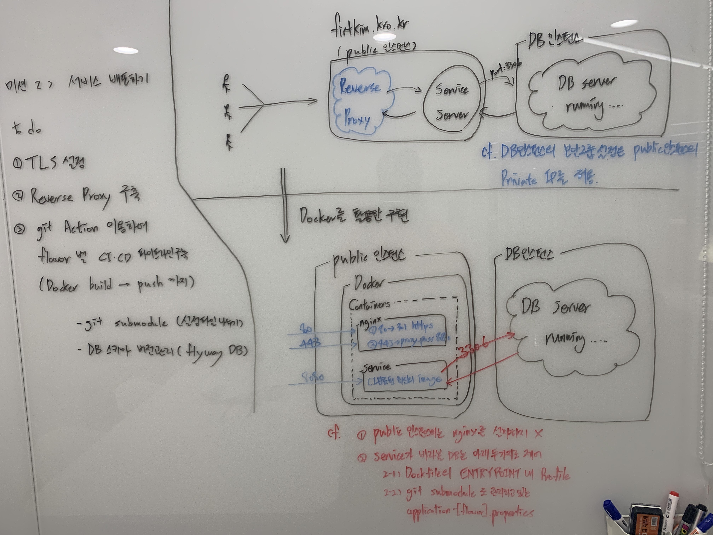

# \[미션 2] 서비스 배포하기 실습

## 사전 개념

### **Forward Proxy, Reverse Proxy**

<figure><figcaption></figcaption></figure>

**Forward Proxy**\
결국 Forward 라는 단어자체가 위치에 대한 개념을 내포하고 있는데, 결국 클라이언트->인터넷->목표서버 의 순서에서 [proxy server](https://ko.wikipedia.org/wiki/%ED%94%84%EB%A1%9D%EC%8B%9C\_%EC%84%9C%EB%B2%84) 의 위치가 인터넷의 앞 혹은 뒤 위치에 따라서 Forward 혹은 Reverse 가 정해진다고 이해하니 편했다.

Forward Proxy는 클라이언트가 특정 도메인에 연결하려고 시도할 때 클라이언트를 인터넷과 직접 연결시키지 않고, 해당 클라이언트의 요청을 대리로 수행해서 인터넷 연결, 결과값 수신, 이를 전달하는 모든 절차를 대신해주는 Proxy를 의미한다. 보안이 철저한 회사에서 정해진 사이트에서만 검색되게 한다던가 하는 기능을 수행하는데 사용된다.


#### Reverse Proxy 

<figure><figcaption></figcaption></figure>

클라이언트->인터넷->목표서버 의 순서에서 목표서버의 바로 앞, 인터넷의 바로 뒤에 위치하여 인터넷을 통해 들어오는 클라이언트의 여러 요청들을 받아서 이를 목표서버에 전달하고 결과값을 받아서 인터넷으로 전달해주는 역할을 한다.

목표는 보안 수위를 올리기 위함인데, 인터넷과 WAS를 직접 붙이게 되면 이미 위험에 노출된 것이므로 그 사이에 Reverse Proxy를 위치시키고 이를 WAS와 연결해두면 클라이언트가 원하는 결과물은 제공해 줄 수 있으면서도 보안의 depth 를 더 깊게 가져갈 수 있다.(참고 : [Defense in depth](https://en.wikipedia.org/wiki/Defense\_in\_depth\_\(computing\)))\


### [**TLS**](https://ko.wikipedia.org/wiki/%EC%A0%84%EC%86%A1\_%EA%B3%84%EC%B8%B5\_%EB%B3%B4%EC%95%88)

사실 SSL의 개념만 알았지 TLS는 이번에 미션 진행하면서 처음 알게된 용어인데, SSL의 취약점을 보완한 것이 TLS라고 이해하면 차이를 이해하기 편한 것 같다. SSL에서 [HeartBleed](https://ko.wikipedia.org/wiki/%ED%95%98%ED%8A%B8%EB%B8%94%EB%A6%AC%EB%93%9C#/media/%ED%8C%8C%EC%9D%BC:Simplified\_Heartbleed\_explanation.svg), FREAK, LogJam, POODLE 등의 문제점들이 발생했고 이를 방지할 수 있는 SSLv3.0이 바로 TLS라고 한다.

그래서 기본적인 HTTPS 방식에 대한 flow를 한번 더 정리해보았다. 이 [사이트](https://jeong-pro.tistory.com/89) 가 정리가 매우 잘되어 있었는데, 칠판에 flow를 나의 말로 정리해보았고 아래와 같이 정리가 되었다.

<figure><figcaption></figcaption></figure>


## 1. 미션 요구사항 <a href="#1" id="1"></a>

<figure><figcaption></figcaption></figure>


이번 미션 요구사항의 포인트는 크게 아래와 같았다고 개인적으로 생각한다.\
\
ㄱ) Reverse Proxy 설정하여 TLS 처리\
ㄴ) 내부망으로 준비해뒀던 인스턴스에 DB 설치 후 서비스 인스턴스에서 연결\
\
그리고 추가적으로 운영 파일들에 대해서 git submodule + private repository 로 관리하는 방법이 매우 재밌었다.


## 2. 미션 실습 <a href="#2" id="2"></a>

### **1) TLS 적용 & Reverse Proxy 구축**

SSL 적용을 회사 입사하여 처음 해봤고, 회사에서도 처음부터 적용한 것이 아니라 누군가 적용해놓은 것을 그대로 다른 서버에 복붙하는 식으로 적용했지 이렇게 처음부터 암호화를 적용해본 적이 없어서 무척 재미있었다. 역시 누군가 해놓은 것을 눈으로 보고 ‘이해하고 있다’, ‘나도 할 수 있겠다’ 라고 오만하게 생각하기 보다는 직접 A to Z 를 해보는게 중요하다는 걸 느꼈다.

미션에서는 인증서 발급을 공짜로 해주는 [CA](https://ko.wikipedia.org/wiki/%EC%9D%B8%EC%A6%9D\_%EA%B8%B0%EA%B4%80) 를 이용해서 암호화 통신을 구현했다. 무료 인증서 발급 CA는 [Let’s Encrypt ](https://letsencrypt.org/)라는 곳을 이용했는데 무료이니 만큼 허용 기간이 짧다(90일). TLS를 적용하는 것은 아래와 같은 절차로 이뤄진다.


ㄱ) [cerbot](https://certbot.eff.org/about/) 를 통해 TLS 인증서 발급\
ㄴ) 발급받은 인증 관련 정보와 함께 nginx 설정 해주고 Reverse Proxy 서버 기동


매우 간편하다. 미션에서는 cerbot을 따로 설치할 것 없이 docker를 이용해서 cerbot을 실행시키고 인증서 발급을 하여 개인키, 공개키를 만들고 인증서 발급을 신청하고 CA에 의해 암호화된 인증서를 받아 저장까지 완료하였다.


```
$ docker run -it --rm --name certbot \
  -v '/etc/letsencrypt:/etc/letsencrypt' \
  -v '/var/lib/letsencrypt:/var/lib/letsencrypt' \
  certbot/certbot certonly -d 'yourdomain.com' --manual --preferred-challenges dns --server https://acme-v02.api.letsencrypt.org/directory
```

\-v 로 경로를 지정해주는 이유는 해당 경로로 CA로부터 받을 예정인 인증서와 certbot이 만든 개인키를 저장하기 위함이다. 예제는 저 주소로 하긴 했는데, 내 컴퓨터의 경로 주소는 사실 내가 편한대로 해도 상관없을 것 같다. 아무튼 certbot 컨테이너를 이용해서 인증서를 발급치 받으면 이를 nginx 설정에 적용해주고, dns 서버 설정에도 적용해준다.


#### **nginx 설정**

```
events {}

http {
  upstream app {
    server 172.17.0.1:8080; <-- 앱을 도커에 띄울 것이므로 172.17.0.1 설정
  }

  # Redirect all traffic to HTTPS
  server {
    listen 80;
    return 301 https://$host$request_uri;
  }

  server {
    listen 443 ssl;
    ssl_certificate /etc/letsencrypt/live/[도메인주소]/fullchain.pem; <-- nginx 컨테이너 내 인증서 위치
    ssl_certificate_key /etc/letsencrypt/live/[도메인주소]/privkey.pem; <-- nginx 컨테이너 내 개인키 위치

    # Disable SSL
    ssl_protocols TLSv1 TLSv1.1 TLSv1.2;

    # 통신과정에서 사용할 암호화 알고리즘
    ssl_prefer_server_ciphers on;
    ssl_ciphers ECDH+AESGCM:ECDH+AES256:ECDH+AES128:DH+3DES:!ADH:!AECDH:!MD5;

    # Enable HSTS
    # client의 browser에게 http로 어떠한 것도 load 하지 말라고 규제
    # 이를 통해 http에서 https로 redirect 되는 request를 minimize 가능
    # https://developer.mozilla.org/ko/docs/Web/HTTP/Headers/Strict-Transport-Security
    add_header Strict-Transport-Security "max-age=31536000" always;

    # SSL sessions
    ssl_session_cache shared:SSL:10m;
    ssl_session_timeout 10m;

    location / {
      proxy_pass http://app;
    }
  }
}
```


#### **Reverse Proxy 기동(위에서 설정한 nginx.conf를 적용한 nginx 기동)**

docker를 이용해서 아래와 같이 Dockerfile을 만들어서 이미지를 build 하고 이를 컨테이너로 띄운다.

```
FROM nginx

COPY nginx.conf /etc/nginx/nginx.conf
COPY fullchain.pem /etc/letsencrypt/live/[도메인주소]/fullchain.pem
COPY privkey.pem /etc/letsencrypt/live/[도메인주소]/privkey.pem
```

여기서 fullchain.pem이 인증서이고 privkey.pem가 개인키이다. COPY 로 시작되는 명령들은 nginx 컨테이너 내 nginx 설정, 인증서, 개인키의 경로를 잡아주는 것인데 앞에는 내가 설정한 nginx.conf 위치, 발급받은 인증서와 개인키의 위치를 지정해주고 뒤에는 지금 build하려고 하는 nginx 컨테이너 내에서 이 파일들이 어디에 위치하게 될지를 설정한다.

그렇기 때문에 지금 설정해주는 인증서, 개인키의 위치와 앞서 nginx.conf에서 설정한 인증서, 개인키의 위치가 일치해야한다.

이렇게 Dockerfile 작성이 끝나면 아래와 같이 nginx를 Reverse Proxy Server로 기동한다.

```
$ docker run -d -p 80:80 -p 443:443 --name proxy nextstep/reverse-proxy
```

여기서 포트를 80을 잡아주는 이유는 의미 그대로 http로 들어올 시에 이를 redirect시켜주기 위함이며, 443은 https를 캐치하기 위함이다. 맨 밑에 칠판에 판서한 그림에 정리가 되어있긴 한데, 궁극적으로 원하는 절차는 아래와 같다.

ㄱ) 80은 443으로 redirect\
ㄴ) 443(https)는 암호화 절차 적용하고 서비스 띄워둔 포트인 8080으로 redirect\
ㄷ) 컨테이너로 띄워둔 서비스(172.17.0.1:8080)로 request 받음\


### **2) 운영 데이터베이스 연결하기(+ git submodule을 이용한 flavor별 설정파일 분기)**

이 과정에서 비로소 이쁘게 망분리를 해놨던 내부망과 연결하게 되었다. 별 것 아닌데도 막상 의도한대로 연결되고 돌아가는것을 보니 재미가 있었다. 운영 데이터베이스 연결과정은 아래 절차에 의해서 진행되었다.


ㄱ) 미리 만들어둔 private repository(flavor별 설정파일이 있는)를 git submodule을 이용하여 src/main/resources/config에 추가\
ㄴ) target profile 에 해당하는 .properties 파일 내에 DB인스턴스 private IP, DB id & password, 스키마 정보 등을 작성\
ㄷ) build할 웹 서비스의 Dockerfile 상에 ENTRYPOINT에 “-Dspring.profiles.active=prod”와 같이 profile 설정\
ㄹ) docker build -> run 하여 DB 연결 되는지 테스트\
\
cf. DB 인스턴스에 위 2) 번에서 입력한 정보대로 DB 정보가 구축되어 있어야 한다. 나는 빠르게 하려고 컨테이너를 사용했다.

```
$ docker run -d -p 3306:3306 -e MYSQL_ROOT_PASSWORD=1004 mysql
$ docker exec -it [docker ps로 알아낸 container ID] bash
$ docker mysql -u root -p => 아까 설정한 비밀번호 1004로 접속
$ create schema [.properties 에서 설정한 접속 스키마 명]
```


미션에서는 빠른 구현을 위해서 DB 인스턴스 내 mysql 을 컨테이너로 기동했지만, 강사님 말씀대로 컨테이너가 추구하는 철학과 DB의 영속성이 성질이 맞지 않기 때문에 제대로 하려면 컨테이너 방식이 아니고 DB인스턴스에 직접 mysql을 직접 설치해서 사용해야한다.

.properties 파일에는 아래와 같이 DB 인스턴스의 Private IP와 적절한 포트 번호를 지정해주고, 스키마도 잘 잡아준다. 당연한 이야기지만 이 설정을 통해 내부망의 DB 인스턴스에 접속이 되게 하려면 DB 인스턴스의 보안그룹 설정에서 접속하려는 인스턴스의 Private IP가 해당 포트로 허용되어 있어야 하며 여기 접속하려는 인스턴스도 라우팅 테이블에 의해서 목적지에 대한 학습이 되어 있어야 한다.

```
spring.datasource.driver-class-name=com.mysql.cj.jdbc.Driver
spring.datasource.url=jdbc:mysql://[ DB instance Private IP Address ]:3306/fistkim101?serverTimezone=UTC&characterEncoding=UTF-8
spring.datasource.username=root
spring.datasource.password=1004
```


### **3) CI\&CD 파이프라인 구축**

실무에서 Jenkins만 사용하다가 git action을 처음 써봤는데, 개인적으로 굉장히 만족스러웠다. 일단 관리 포인트가 많아지는게 무척 피곤한 일인데(모르겠다 내 성격 탓인지 단순한게 좋다) CI\&CD이슈를 뭔가 다른 곳에 ‘들어가서’ 빌드가 잘되고 있나, 스크립트는 어떤식으로 짜고.. 이런 관리를 하는게 너무 귀찮았다. git action은 어차피 git에서 CI\&CD 까지 한번에 다룰 수 있어서 좋았고 CI\&CD 의 미시적인 전략 자체를 어딘가에 ‘들어가서’ 확인하는게 아니라 IDE 상에서 소스로 확인할 수 있어서 좋았다. 특히 git action을 호출하고 CI\&CD 절차를 시각적으로 볼 수 있는데 이 역시 매우 좋았다. 아래는 내가 짜놓은 절차에 맞게 자동으로(내가 따로 설정할 것 없이 yml을 참조하여 자동으로) 보여지는 CI\&CD가 도식화된 그림이다.


<figure><figcaption></figcaption></figure>

**UI가 매우 깔끔하고 아주 마음에 든다**


git action을 사용하면서 매우 뼈아픈 실수를 했는데, 너무 우습게 보고 공식 document를 안보고 그냥 사용법을 여러 블로그들을 보면서 익혀서, self-hosted가 작동을 안하는 데에서 엄청 시간 소요를 많이했다. 6시간 정도는 삽질을 한 것 같다. 뭐든 처음 학습 하는 것은 공식 document를 꼼꼼히, 적어도 대략적으로라도 읽고 ‘뭐가 어디있는지’ 정도는 reference에 대해 알고 해야겠다고 다시 한번 생각했다.

내가 작성한 git action을 위한 파일은 아래와 같다. 아래는 미션 수행을 위해서 짠 것이고, 실제로 내가 실무에 적용한다면 self-hosted를 적극 활용 할 것이기 때문에 실무용 yaml파일은 아래와 조금 달라질 것 같다.

혹시라도 이 글을 보게되는 누군가가 git action을 사용하고자 한다면 꼭 [공식문서](https://docs.github.com/en/actions/learn-github-actions) 를 한번 훑어보고 사용하길 바란다. 1시간 30분 정도면 거의 다 읽어진다. 그리고 내가 실수했던 host 관련한 부분은 [여기](https://docs.github.com/en/actions/reference/workflow-syntax-for-github-actions#jobsjob\_idruns-on) 에 있다. 내가 실수한 부분은 각 job별로 파일 혹은 workspace가 공유되지 않는 다는 것을 몰라서 시간을 허비한 것이다. 공식 문서에 매우 친절하고 명확하게 명시되어 있는데도 사용하기만 급급해서 이를 놓쳤다.


```yaml
name: production

on:
  push:
    branches: [ main ]
  pull_request:
    branches: [ main ]

jobs:
  test:
    runs-on: ubuntu-latest
    name: test
    steps:
      - name: checks-out this repository under GITHUB_WORKSPACE(enable to access)
        uses: actions/checkout@v2
        with:
          token: $
          submodules: recursive

      - name: set up JDK 11
        uses: actions/setup-java@v2
        with:
          java-version: '11'
          distribution: 'adopt'

      - name: grant execute permission for gradlew
        run: chmod +x gradlew

      - name: test with Gradle
        run: ./gradlew test

  docker_image_build_and_push:
    runs-on: ubuntu-latest
    needs: [ test ]
    name: docker build and push
    steps:
      - name: checks-out this repository under GITHUB_WORKSPACE(enable to access)
        uses: actions/checkout@v2
        with:
          token: $
          submodules: recursive

      - name: set up JDK 11
        uses: actions/setup-java@v2
        with:
          java-version: '11'
          distribution: 'adopt'

      - name: grant execute permission for gradlew
        run: chmod +x gradlew

      - name: test with Gradle
        run: ./gradlew build -x test

      - name: set up QEMU
        uses: docker/setup-qemu-action@v1

      - name: set up Docker Buildx
        uses: docker/setup-buildx-action@v1

      - name: login to DockerHub
        uses: docker/login-action@v1
        with:
          username: $
          password: $

      - name: docker image build and push
        id: docker_build
        uses: docker/build-push-action@v2
        with:
          context: .
          file: ./Dockerfile
          push: true
          tags: $/infra-subway:latest

  slack_notification:
    runs-on: ubuntu-latest
    needs: [ test, docker_image_build_and_push ]
    name: slack notification
    steps:
      - uses: actions/checkout@v2
      - name: Slack Notification
        uses: rtCamp/action-slack-notify@v2
        env:
          SLACK_WEBHOOK: $

```

### **4) 서비스 컨테이너 기동**

서비스를 위한 Dockerfile을 만들어서 위에서 작성해둔 CI\&CD 과정에 이것이 쓰이게 만들면 된다. 제대로 CI\&CD 파일을 작성하고 필요한 정보를 secrets에 설정해뒀다면 docker hub에 docker image가 push 될 것이다. 내가 만약 실무에 이를 적용한다면 해당 과정은 ubuntu-latest로 처리하고 모든게 성공하면 이 최신의 이미지를 self-hosted가 pull 받아서 해당 이미지를 run 시키도록 할 것이다.

```
FROM openjdk:11-jre-slim
ARG JAR_FILE=build/libs/*.jar
COPY ${JAR_FILE} subway.jar
ENTRYPOINT ["java", "-jar", "-Dspring.profiles.active=prod", "/subway.jar"]
```


### **5) 그 외 추가(데이터베이스 테이블 스키마 버전관리, 정적 테스트, 로컬 테스트, git issue 활용)**

[Flyway](https://flywaydb.org/) 라는 것을 이용한 데이터베이스 테이블 스키마의 버전 관리와 [Sonarlint](https://www.sonarlint.org/) 라는 플러그인을 활용한 정적 테스트, 그리고 [Multirun](https://plugins.jetbrains.com/plugin/7248-multirun) 이라는 플러그인을 이용해서 로컬 테스트를 편하게 하는 방법 등을 배웠다.

가장 좋았던 것은 git issue 에 대한 활용이다. 사실 외부 라이브러리를 사용할 때 뭔가 안될때만 issue란을 봤지 내가 개발을 하면서 이걸 써보진 않았다. 쓸 생각도 안했었고. 왜냐면 회사에서는 jira로 개발 이슈들도 같이 다뤘기 때문이다. 하지만 기획과 무관하게 순수하게 개발적인 이슈는 사실 jira보다는 git에서 관리하는게 더 편한 것 같다는 생각이 들었다. 그래서 앞으로 개인 프로젝트든 실무에서든 git issue를 적극적으로 사용 해봐야겠다는 생각이 들었다.


## 총정리 <a href="#undefined" id="undefined"></a>

<figure><figcaption></figcaption></figure>
