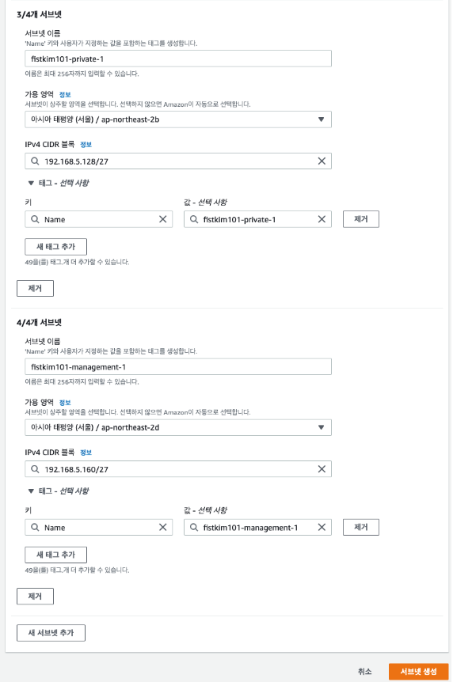

# (+) 테스트 자동화



테스트 자체에 대한 내용은 아니고 성능테스트라는 행위를 분절화 해서 이해하고, 자동화 할 수 있는 부분을 떼어내어서 자동화 한 사례를 소개해주고 있다.

<figure><figcaption></figcaption></figure>

<figure><figcaption></figcaption></figure>

<figure><figcaption></figcaption></figure>

<figure><figcaption></figcaption></figure>

<figure><figcaption></figcaption></figure>

<figure><figcaption></figcaption></figure>

<figure><figcaption></figcaption></figure>

<figure><figcaption></figcaption></figure>

<figure><figcaption></figcaption></figure>

<figure><figcaption></figcaption></figure>

<figure><figcaption></figcaption></figure>

<figure><figcaption></figcaption></figure>

<figure><figcaption></figcaption></figure>

<figure><figcaption></figcaption></figure>

<figure><figcaption></figcaption></figure>

<figure><figcaption></figcaption></figure>

<figure><figcaption></figcaption></figure>





위 두 레퍼런스를 보고 시행착오(?) 를 좀 겪으면 테스트 자동화를 구현해볼 수 있을 것 같다. 실제로 한번 구축을 해보면 의미 있는 경험일 것 같다.
